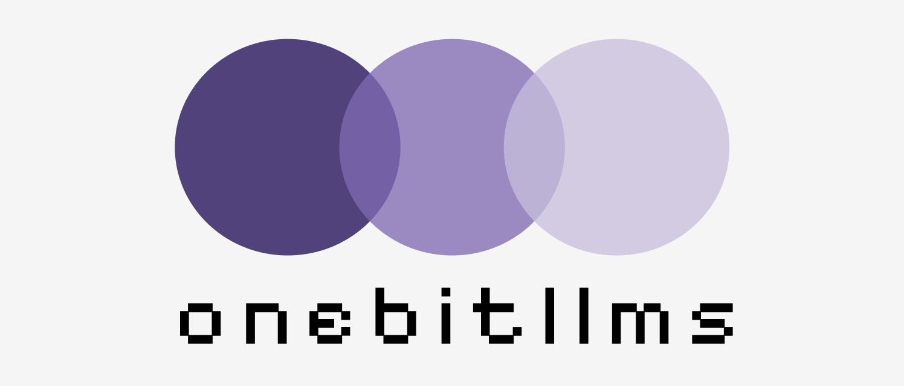

<p align="center">
  
</p>

> `onebitllms` is a lightweight python package that can be used to easily perform Large-Language Model (LLMs) fine-tuning following the training procedure from BitNet, to produce customized 1.58-bit LLMs.

## Installation

Download the package through pip:

```bash
pip install onebitllms
```

or directly from source:

```bash
pip install git+https://github.com/tiiuae/onebitllms.git
```

## Getting started

### 1.58bit Fine-tuning

Simply use the `replace_linear_with_bitnet_linear` after loading the **pre-quantized** checkpoint, and use directly that model for fine-tuning (e.g. with `SFTTrainer` from `trl` library):

```python
import torch
from transformers import AutoModelForCausalLM, AutoTokenizer
from onebitllms import replace_linear_with_bitnet_linear

model_id = "tiiuae/Falcon-E-1B-Base"
revision = "prequantized"

tokenizer = AutoTokenizer.from_pretrained(
    model_id, revision=revision
)

model = AutoModelForCausalLM.from_pretrained(
    model_id,
    revision=revision,
    torch_dtype=torch.bfloat16,
    device_map="auto"
)

model = replace_linear_with_bitnet_linear(model)

# Do the training here ...
```

After training your model, make sure to quantize the final checkpoint in 1-bit precision with the method `quantize_to_1bit`:

```python
from onebitllms import quantize_to_1bit

model_output_dir = ""
quantized_model_output_dir = ""

quantize_to_1bit(model_output_dir, quantized_model_output_dir)
```

Example scripts can be found in `examples/`. We use the following command on a 8xA10G 23GB instance and training took ~8.5 hours.

```bash
python examples/sft.py \
    --model_name_or_path tiiuae/Falcon-E-1B-Base \
    --model_revision prequantized \
    --torch_dtype bfloat16 \
    --learning_rate 0.0001 \
    --dataset_name trl-lib/Capybara \
    --per_device_train_batch_size 1 \
    --output_dir Falcon-E-Capybara \
    --logging_steps 1 \
    --save_strategy steps \
    --save_steps 100 \
    --packing \
    --gradient_accumulation_steps 16
```

Once your 1.58bit model is ready, we suggest you to deploy it with [`bitnet.cpp` package](https://github.com/microsoft/BitNet).

### Using quantization triton kernels

You can also inject the `BitNetLinear` classes into your pre-training framework:

```python
from onebitllms import BitNetLinear

# inject it in your model classes for pre-training ..
```

You can also use the triton kernels directly for a more fine-grained control over the operations:

```python
from onebitllms import activation_quant_triton, weight_quant_triton
```

### Revert back to bfloat16 format

From our experiments, the BitNet checkpoints are *universal*, meaning we can revert back to bfloat16 format with minimal performance degradation. You can use the method `convert_to_bf16` after training your model:

```python
from onebitllms import convert_to_bf16

model_output_dir = ""
quantized_model_output_dir = ""

convert_to_bf16(model_output_dir, quantized_model_output_dir)
```

## Common questions

*What is 1-bit fine-tuning?*

We term *1-bit fine-tuning* as simply doing continuous training from a **pre-quantized** BitNet compatible checkpoint. As of today, there are multiple ongoing work that explores fine-tuning existing checkpoints into BitNet format but this often leads to poor performance.

*What models can I fine-tune?*

To the best of our knowledge, as of today, only Falcon-Edge and recent Microsoft BitNet series models published their **pre-quantized** checkpoints. If in the future other models gets published together with their **pre-quantized** checkpoints, they should be compatible with `onebitllms` out-of-the-box.

*What else can I do with `onebitllms`?*

You can also use the `BitnetLinear` class exposed in this package and use it inside your pre-training / fine-tuning framework. In contrary to existing implementation, we use optimized triton kernels for computing the quantization errors making the pre-training and fine-tuning much faster than existing implementations. From our experiments, we estimate the overheads between non-BitNet and BitNet pre-training to be around ~20% (to be confirmed with more rigourous analysis).

*Is LoRA supported in `onebitllms`?*

LoRA is not supported with this package and remains a very interesting research question. Unlocking LoRA with `onebitllms` could open-up exciting opportunities such as being able to fine-tune a BitNet 7B on a free-tier Google Colab instance.

*Can `onebitllms` used for inference?*

As of today, BitNet models are extremely interesting for CPU deployment. We strongly encourage users to deploy their models with [`bitnet.cpp`](https://github.com/microsoft/BitNet/) package after fine-tuning it with `onebitllms`. If you want to run it on GPU, to the best of our knowledge, you can use HuggingFace's `transformers` native integration of BitNet models.

*Can I contribute to `onebitllms`?*

Of course. Contributions to enhance the codebase, introduce new features and example scripts are strongly encouraged.

## Citation

If you find this work useful for your research and work, please consider citing us, as well as citing the foundational work behind BitNet models:

```
@misc{tiionebitllms,
    title = {Falcon-E, a series of powerful, universal and fine-tunable 1.58bit language models.},
    author = {Falcon-LLM Team},
    month = {May},
    url={https://github.com/tiiuae/onebitllms}, 
    year = {2025}
}
```

```
@misc{wang2025bitnetcppefficientedgeinference,
      title={Bitnet.cpp: Efficient Edge Inference for Ternary LLMs}, 
      author={Jinheng Wang and Hansong Zhou and Ting Song and Shijie Cao and Yan Xia and Ting Cao and Jianyu Wei and Shuming Ma and Hongyu Wang and Furu Wei},
      year={2025},
      eprint={2502.11880},
      archivePrefix={arXiv},
      primaryClass={cs.LG},
      url={https://arxiv.org/abs/2502.11880}, 
}
```

```
@misc{,
      title={1.58-Bit LLM: A New Era of Extreme Quantization}, 
      author={Mohamed Mekkouri and Marc Sun and Leandro von Werra and Thomas Wolf},
      year={2024},
}
```

```
@misc{ma2024era1bitllmslarge,
      title={The Era of 1-bit LLMs: All Large Language Models are in 1.58 Bits}, 
      author={Shuming Ma and Hongyu Wang and Lingxiao Ma and Lei Wang and Wenhui Wang and Shaohan Huang and Li Dong and Ruiping Wang and Jilong Xue and Furu Wei},
      year={2024},
      eprint={2402.17764},
      archivePrefix={arXiv},
      primaryClass={cs.CL},
      url={https://arxiv.org/abs/2402.17764}, 
}
```

```
@misc{wang2023bitnetscaling1bittransformers,
      title={BitNet: Scaling 1-bit Transformers for Large Language Models}, 
      author={Hongyu Wang and Shuming Ma and Li Dong and Shaohan Huang and Huaijie Wang and Lingxiao Ma and Fan Yang and Ruiping Wang and Yi Wu and Furu Wei},
      year={2023},
      eprint={2310.11453},
      archivePrefix={arXiv},
      primaryClass={cs.CL},
      url={https://arxiv.org/abs/2310.11453}, 
}
```
